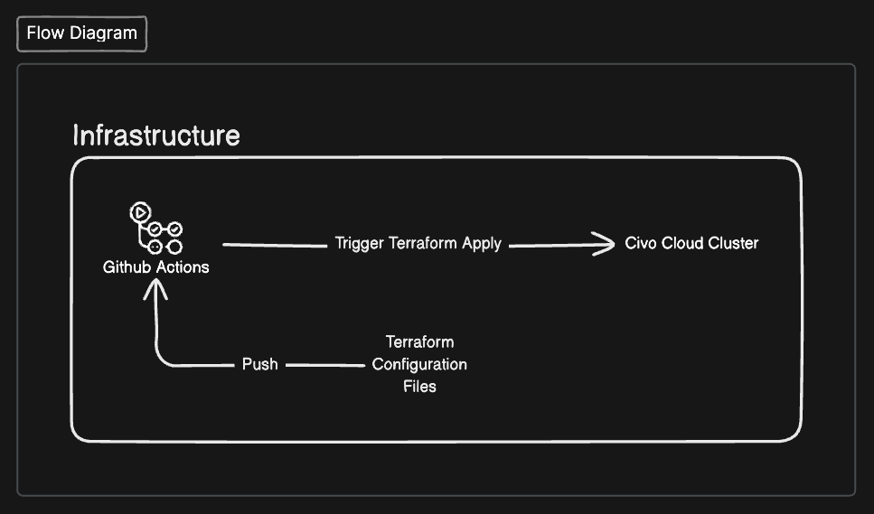

# forminit-infra

This repo contains terraform code for deploying a minimalistic infrastructure for a web application. The infrastructure includes:

1. A 3 node cluster in Civo Cloud using Kubernetes.
2. A kubernetes namespace for the web application.

